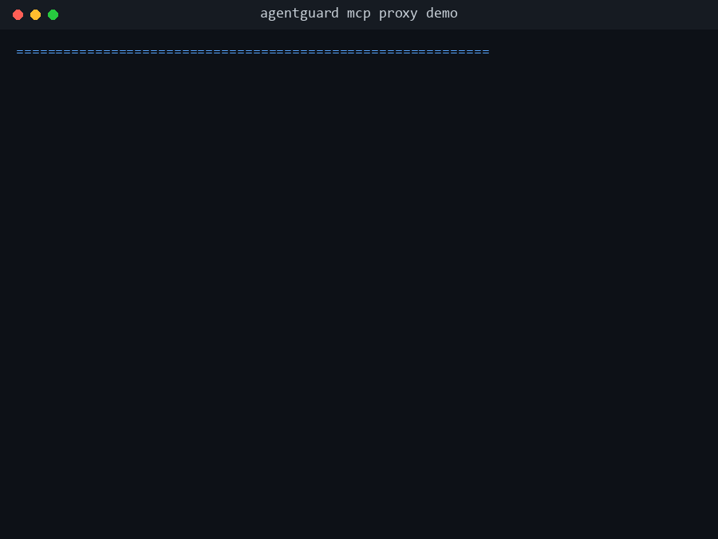

# AgentGuard

[](https://github.com/Shashank-016/agentguard/actions/workflows/ci.yml)
[](LICENSE)
[](https://www.python.org/)
[](https://modelcontextprotocol.io/)

**A security layer for AI agents.** AgentGuard detects prompt injection, firewalls dangerous tool
calls, scores cross-agent trust, and keeps a tamper-evident audit trail — across the Anthropic &
OpenAI SDKs, LangGraph, and any MCP server. Drop it in with a one-line change; no rewrite of your
agent logic.



## Why

Autonomous agents take actions — they read documents, call tools, write files, hit APIs. That
turns a prompt-injection string in a web page or a tool result into a way to *make the agent do
something*, not just say something. Most teams have no visibility into what their agents are
doing and no enforcement layer between the model's decision and the action. AgentGuard is that
layer.

## Install

```bash
git clone https://github.com/Shashank-016/agentguard
cd agentguard
pip install -e ".[langgraph,openai]"   # extras optional; base install works on its own
```
<!-- Note: a PyPI release is planned; until then, install from source as above. -->

## Quick start (30 seconds)

```python
import anthropic
from agentguard import GuardedClient

# Wrap your existing client — same interface as anthropic.Anthropic()
client = GuardedClient(
    anthropic.Anthropic(),
    agent_id="researcher",
    policy_path="policy.yaml",   # optional
    mode="observe",              # "observe" | "enforce" | "interactive"
)

# Use it exactly as before. AgentGuard scans inputs, checks tool calls,
# logs every event, and (in enforce mode) blocks dangerous actions.
resp = client.messages.create(
    model="claude-haiku-4-5-20251001",
    max_tokens=512,
    messages=[{"role": "user", "content": "Summarize this document..."}],
)
```

See it catch a real attack:

```bash
python examples/mcp_proxy_demo.py
# An agent reads a poisoned document and tries a privileged write —
# AgentGuard blocks it at the tool layer and prints a session report.
```

## Add AgentGuard to your own agent

One line at the point you create your client or graph. Everything downstream is instrumented.

**Anthropic SDK**
```python
from anthropic import Anthropic
from agentguard import GuardedClient

client = GuardedClient(Anthropic(), agent_id="my-agent", policy_path="policy.yaml", mode="enforce")
```

**OpenAI SDK**
```python
from openai import OpenAI
from agentguard import GuardedOpenAI

client = GuardedOpenAI(OpenAI(), agent_id="my-agent", policy_path="policy.yaml", mode="enforce")
```

**LangGraph** — attach the callback to any graph/runnable:
```python
from agentguard import AgentGuardCallback

graph.invoke(state, config={"callbacks": [AgentGuardCallback(session_id="run-1")]})
```

**Any MCP tool server** — run AgentGuard as a transparent proxy, no agent code change at all.
Point your MCP client at AgentGuard instead of the real server:
```bash
agentguard mcp proxy stdio \
  --upstream-cmd "npx -y @modelcontextprotocol/server-filesystem /data" \
  --agent-id my-agent \
  --policy policy.yaml \
  --mode enforce
```

Async variants (`AsyncGuardedClient`, `AsyncGuardedOpenAI`) and streaming are supported with the
same interface. Events flow to an in-memory bus, an optional SQLite store, and a hash-chained
JSONL audit log; view them via the bundled FastAPI service and React dashboard (see below).

---

## Policy File

```yaml
version: "1"
agents:
  researcher:
    allowed_tools: [web_search, read_file]
    denied_tools:  [write_file, execute_code]
    rate_limits:
      web_search: 10/minute

  writer:
    allowed_tools: [write_file, read_file]
    denied_tools:  [web_search, execute_code]
```

### Argument constraints

Tool *names* are only half the story — `write_file("/etc/crontab", payload)` passes a
name-level check for any agent allowed to use `write_file`. `ToolPolicyEngine.check_arguments()`
inspects the *arguments* of a tool call, combining always-on built-in detectors with
per-tool rules declared in the policy file:

```yaml
agents:
  writer:
    tool_constraints:
      write_file:
        path_allowlist: ["/tmp/**", "./output/**"]   # only these globs are permitted
        path_denylist:  ["/etc/**", "~/.ssh/**"]      # these are always blocked
        max_arg_length: 10000                         # flag oversized argument values
      fetch:
        url_denylist: ["169.254.169.254", "localhost", "10.*"]
        # url_allowlist, arg_denylist also supported
```

Built-in detectors run on every tool call regardless of configuration:

| Detector | Flag | Triggers on |
|----------|------|-------------|
| Path traversal | `constraint:path_traversal` | `../`, `..\`, or URL-encoded `%2e%2e` in any argument |
| SSRF targets | `constraint:ssrf_target` | URLs/hosts pointing at `169.254.169.254`, `localhost`, `127.0.0.1`, RFC-1918 ranges, `metadata.google.internal` |
| Shell metacharacters | `constraint:shell_metachar` | `;`, `\|`, `&&`, `` ` ``, `$(`, `>`, `<` in arguments to tools whose name suggests command execution (`exec`, `shell`, `command`, `run`, `bash`, `sh`) |
| Sensitive path access | `constraint:sensitive_path` | `/etc/`, `/root/`, `~/.ssh`, `id_rsa`, `.env`, `credentials`, `/proc/` |

Violations are emitted as `policy_violation` events with `severity="critical"` and raise
`AgentGuardException` in `enforce` mode — both from the SDK wrappers (checked against the
arguments the model produced, before the agent runtime executes the tool) and from the MCP
proxy (checked before the call is forwarded upstream, where blocking actually prevents execution).

---

## What Gets Detected

| Threat | Detection Method | Default Severity |
|--------|-----------------|-----------------|
| Jailbreak attempt | Regex: "ignore previous instructions", "you are now DAN" | Critical |
| System prompt exfiltration | Regex: "print your system prompt", "repeat everything above" | Critical |
| Role override | Regex: "act as if you have no restrictions" | Critical |
| Tool abuse via injection | Regex: "call the write_file tool" | Critical |
| Indirect injection (docs, web) | Regex + embedding similarity | Warning/Critical |
| Tool policy violation | YAML policy engine | Critical |
| Rate limit exceeded | Sliding window counter | Critical |
| Low-trust agent calling sensitive tools | Trust score degradation | Warning |
| Multi-agent trust chain poisoning | Multiplicative provenance tracking | Warning |

---

## Response modes

Every guarded client, callback, and the MCP proxy take a `mode`:

| Mode | Behavior |
|------|----------|
| `"observe"` (default) | Detect and log everything — never interrupts the agent. |
| `"enforce"` | Raise `AgentGuardException` (or return a JSON-RPC error from the MCP proxy) on any hard violation. A fixed, pre-decided policy. |
| `"interactive"` | Route violations to a human (or programmatic approver) for a real-time decision via `ApprovalGate`. A "deny" blocks the call just like enforce mode; an "approve" lets it through. |

`"interactive"` mode is for situations where a blanket policy is too coarse — let
a human apply judgment to a specific borderline case instead of pre-encoding
every exception:

```python
from agentguard import GuardedClient, ApprovalGate
from agentguard.control import ApprovalRequest, ApprovalDecision

def slack_approval_handler(request: ApprovalRequest) -> ApprovalDecision:
    # Post to Slack, wait for a thumbs-up/thumbs-down reaction, etc.
    ...
    return "approve"  # or "deny"

client = GuardedClient(
    anthropic.Anthropic(),
    agent_id="researcher",
    mode="interactive",
    approval_gate=ApprovalGate(handler=slack_approval_handler),
)
```

Each request emits `approval_required`, then `approval_granted` or
`approval_denied`, so the full decision trail lands in the audit log. The
default handler (when no `approval_gate=` is supplied) prompts on the CLI with
a y/N confirmation — fine for local development, but register your own handler
(Slack, a web UI, a queue) for anything running unattended. A misbehaving or
exception-raising handler defaults to `"deny"` — approval gates fail closed.

Note: `trust_flag` warnings never hard-block in `enforce` mode (a low trust
score alone shouldn't halt an agent), but in `interactive` mode they still
route through the approval gate — a human's explicit "deny" blocks the call.
This gives interactive mode finer-grained control than a blanket policy.

### Kill switch

Independent of `mode`, any session — or every session in the process — can be
halted immediately via `KillSwitch`:

```python
from agentguard.control import get_default_kill_switch

switch = get_default_kill_switch()
switch.kill_session("session-123")   # halt one session
switch.kill_all()                    # halt every session in this process
switch.revive_session("session-123") # restore it
switch.status()                      # {"global": False, "killed_sessions": [...]}
```

A killed session's next intercepted action raises `AgentGuardKilled` (a subclass
of `AgentGuardException`) — or, for the MCP proxy, returns a JSON-RPC error
(`AGENTGUARD_SESSION_KILLED`) — *before* any API call or tool execution happens.
A critical `session_end` event with `flags=["kill:tripped"]` is emitted first,
so the halt is visible in the audit trail.

The same switch is reachable over HTTP once the audit API is running:

```bash
curl -X POST http://localhost:8000/control/kill/session-123
curl -X POST http://localhost:8000/control/kill-all
curl -X POST http://localhost:8000/control/revive/session-123
curl http://localhost:8000/control/status
```

These endpoints affect sessions in the API process only — a multi-process
deployment needs a shared backing store (see Roadmap) for one trip to halt
every worker. They're also unauthenticated for now; put them behind your own
auth/network controls before exposing them.

---

## Tamper-evident audit log

`AuditLogger` (passed via `audit_log=` to any guarded client/callback) writes one JSON
object per line to a durable JSONL file. By default (`chained=True`) every record also
carries `prev_hash` — the SHA-256 `record_hash` of the previous line, with a genesis value
of 64 zeros for the first line in a fresh file — and its own `record_hash`, a digest over
the record's canonical JSON plus `prev_hash`. Editing or deleting any line breaks the link
to the next record, so tampering is always detectable, not just guessable. The chain
survives process restarts (it resumes from the last line on disk) and rotations (the new
file's first record continues from the rotated file's last hash).

```bash
agentguard audit verify agentguard_audit.jsonl
# ✓ Chain intact — 1,432 records verified
#   (or, if a line was edited or removed:)
# ✗ Chain broken at line 87 — record was modified or a prior line was deleted

agentguard audit tail agentguard_audit.jsonl -n 50
agentguard audit stats agentguard_audit.jsonl   # counts by event_type and severity
```

This gives you a forensic trail suitable for SOC 2 / ISO 27001 evidence: an auditor (or an
incident responder) can independently confirm that the log they're looking at is the
complete, unaltered record AgentGuard produced — not a reconstruction. It does not, by
itself, prove *who* tampered with a file; pair it with filesystem-level access controls and
off-host replication for full chain-of-custody guarantees.

---

## Running the API + Dashboard

```bash
# 1. Install
pip install -e ".[langgraph]"

# 2. Start the audit API
uvicorn api.main:app --reload

# 3. Start the dashboard
cd dashboard
npm install
npm run dev
# → http://localhost:5173

# 4. Run the demo
python examples/langgraph_demo.py
```

See [`dashboard/README.md`](dashboard/README.md) for dashboard-specific setup, including how to
authenticate against an API started with `AGENTGUARD_API_KEY` set.

---

## Running Tests

```bash
pytest
```

---

## Trust Scoring

AgentGuard tracks *information provenance* across agent hops. When a session processes external content (a file, a web page, a user upload), its trust score degrades:

```
Initial:          1.0  (TRUSTED  — human instructions)
After file read:  0.3  (EXTERNAL — external content processed)
After handoff:    0.21 (EXTERNAL — downstream agent inherits low trust)
After injection:  0.0  (UNTRUSTED — flagged)
```

When trust drops below 0.5, any attempt to call a sensitive tool (write, execute, send, delete) emits a `trust_flag` warning even if the tool is otherwise policy-allowed.

---

## Roadmap

- [x] **OpenAI SDK support** — `GuardedOpenAI` / `AsyncGuardedOpenAI` wrap `openai.OpenAI` / `AsyncOpenAI`
- [x] **Async GuardedClient** — `AsyncGuardedClient` wraps `AsyncAnthropic` for async codebases
- [x] **Streaming support** — `GuardedStream` / `AsyncGuardedStream` intercept `messages.stream()`
- [x] **MCP server integration** — transparent stdio + SSE proxy for Model Context Protocol
- [x] **Tamper-evident audit log** — SHA-256 hash-chained JSONL with `agentguard audit verify`
- [x] **Human-in-the-loop approval** — `mode="interactive"` routes violations through `ApprovalGate`
- [x] **Kill switch** — halt any session (or every session) immediately, programmatically or via `/control`
- [ ] **OpenTelemetry export** — emit spans/traces to any OTEL-compatible backend
- [ ] **Multi-process bus** — Redis-backed EventBus for distributed agent deployments
- [ ] **Slack/PagerDuty alerting** — push critical events to on-call channels
- [ ] **SARIF export** — machine-readable security findings for CI integration
- [ ] **Policy hot-reload** — watch policy.yaml for changes without restart

---

## License

MIT — see [LICENSE](LICENSE)
